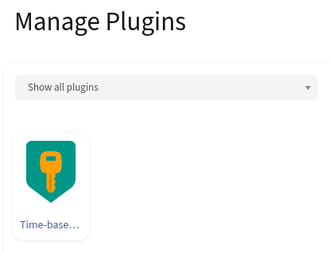
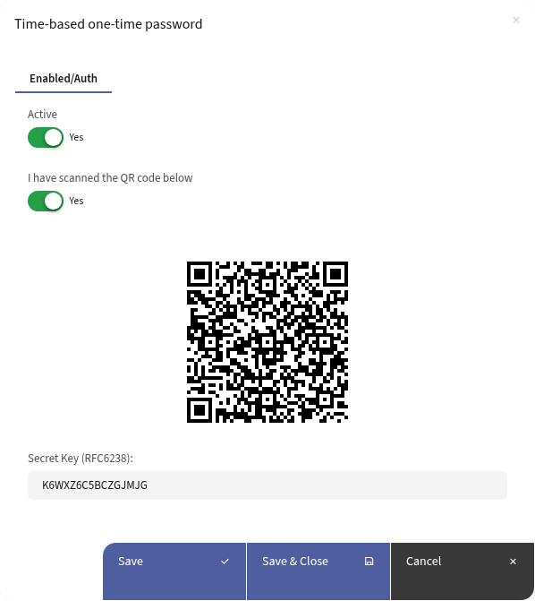

# Mautic TOTP Plugin

Tested on Mautic 5.2.4, 6.0.0 and 7.0.0-alpha

This plugin is offered by FireMultimedia.
Would you like to use Mautic worry-free, with built-in extra features like this plugin? Get in touch with us at https://www.firemultimedia.nl/mautic-hosting/.

## Installation
1. Execute `composer require firemultimedia/mautic-totp-bundle` in the main directory of the mautic installation
2. flush the cache `php bin/console cache:clear`.
3. Navigate to the Plugins page and click "Install/Upgrade Plugins".

You should now see the new plug-in.

## Configuration
Scan the QR code or manually copy the secret key into your OTP provider.

Confirm that you have scanned the code and activate the plug-in.
